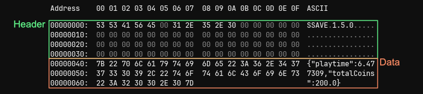

# Examples

## File Format + External Editing

Saved files are split into two sections: the **header** and the **data**.

- The header reserves **64** bytes of the start of the file, and is used to store internal information about the save. Do not edit this section as it will corrupt your save file.
- The data, depending on what [`SSAVE_PROTECTION`](enums.md#ssave_protection) level you set, may be represented in plaintext, encoded or encrypted json.



If you want to edit your save files externally, make sure you're using a file editor that won't interfere with the header information (like [Notepad++](https://notepad-plus-plus.org/)), otherwise you could get a corrupted file.

## Using SSave Without the Manager

While the [`SSaveManager`](ssave-manager.md) is a convenient, hands-off way to handle and cache saves, you may find yourself wanting more control.

Assuming you have a `SaveFile` class like this:

```js
function SaveFile() : SSave() constructor {
    // ...
}
```

Instead of using [`ssave_get()`](ssave-manager.md#ssave_getssaveconstructor-fileprefix), you can directly create an instance of `SaveFile` and manage it manually:

```js
var _save = new SaveFile();
_save.load();
```

Using the `new` operator will create an empty `SaveFile` instance. Now you can call [`load()`](ssave.md#ssaveloadfileprefix) to populate it with data from disk, or [`save()`](ssave.md#ssavesave) to write the current state to disk as usual.
You'll likely need to create some kind of persistent object/script to store your saves, else you will incur a performance pentaly by constantly loading your save every time you need it.

## Multiple Saves

If you want to have different save files of the same class, you can! When saving and loading files, you are given the option to specify a file prefix. Using this, we can store multiple saves of the same class without overwriting each other. File prefixes can be any number or string.

### Using the Manager

If you're using the [`SSaveManager`](ssave-manager.md), the second argument in [`ssave_get()`](ssave-manager.md#ssave_getssaveconstructor-fileprefix) is the file prefix.

```js
var _saveSlot1 = ssave_get(SaveFile, 1);
var _saveSlot2 = ssave_get(SaveFile, 2);
var _saveFoo = ssave_get(SaveFile, "foo");
```

### When Not Using the Manager

If you're manually creating instaces of your save class, you'd need to use the [`set_file_prefix()`](ssave.md#ssaveset_file_prefixfileprefix) method.

```js
var _saveSlot1 = new SaveFile();
_saveSlot1.set_file_prefix(1);
_saveSlot1.load();

var _saveSlot2 = new SaveFile();
_saveSlot2.set_file_prefix(2);
_saveSlot2.load();

var _saveFoo = new SaveFile();
_saveFoo.set_file_prefix("foo");
_saveFoo.load();
```

## Encoding or Encrypting Saves

If you feel the need to encode or encrypt your saves, you can!

By setting your desired [`SSAVE_PROTECTION`](enums.md#ssave_protection) level via [`set_protection()`](ssave.md#ssaveset_protectionprotection), the next time you call [`save()`](ssave.md#ssavesave) the file will be written with the specified protection. The protection level is cached, so you only need to call it once per change.

When you call [`load()`](ssave.md#ssaveloadfileprefix), SSave will automatically detect the protection level and decode/decrypt the file accordingly; you don't need to call [`set_protection()`](ssave.md#ssaveset_protectionprotection) again.

```js
// saving
var _save = new SaveFile();
_save.set_protection(SSAVE_PROTECTION.ENCRYPT);
_save.save();

// loading
var _save = new SaveFile();
_save.load();
var _protection = _save.get_protection(); // returns SSAVE_PROTECTION.ENCRYPT
```

You can edit the [`SSAVE_PROTECTION_DEFAULT`](config.md#ssave_protection_default) configuration to change the default protection level for all saves which have not yet had their protection set.

## Deleting Saved Files

If you want to delete a saved file, you can use the [`ssave_erase()`](ssave-manager.md#ssave_erasessaveconstructor-fileprefix) or [`erase()`](ssave.md#ssavedeletefileprefix) functions.

```js
// Using the manager
ssave_erase(SaveFile);

// Not using the manager
var _save = new SaveFile();
_save.erase();
```
